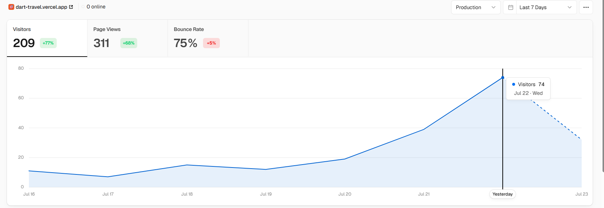

# 🎯 다트 여행

> 지도에 다트를 던져 랜덤 국내 여행지를 결정하세요

**[→ 서비스 바로가기](https://dart-travel.vercel.app)**

SNS에서 유행하는 "다트로 지도 찍어 여행지 정하기"에서 영감을 받아 만든 서비스입니다.

---

## ✨ 주요 기능

- **랜덤 여행지 추천** — 전국 여행지 중 랜덤 선택 (여행지는 지속적으로 업데이트)
- **다트 던지기 애니메이션** — D3.js 기반 정밀 한국 지도 + 베지어 곡선 다트 애니메이션
- **여행지 상세 정보** — 한국관광공사 공식 사진, 여행지 소개, 꿀팁 제공
- **여행 맛보기** — 네이버 블로그 검색 API 연동으로 관련 블로그 5개 제공
- **조건 필터링** — 계절 / 테마별 필터로 사용자 니즈에 맞는 여행지 후보군 설정

---

## 🛠 기술 스택

| 분류       | 기술                                   |
| ---------- | -------------------------------------- |
| Framework  | Next.js 16 (App Router)                |
| Language   | TypeScript                             |
| Animation  | Framer Motion                          |
| Map        | D3.js + GeoJSON                        |
| Database   | Supabase (Postgres) (도입 예정)        |
| API        | 한국관광공사 Tour API, 네이버 검색 API |
| Deployment | Vercel (+ Vercel Cron)                 |

## 🧭 향후 개발 방향

(2026-07-23) 
사실 하루에 소소하게 5명만 들어와도 성공이라고 생각한 사이드 프로젝트였는데 어느날 확인해보니 방문수가 내 예상을 뛰어넘었다..
 Develop 하고 싶은 부분들이 꽤나 있었지만 이용자가 없다면 큰 의미가 없다고 판단하여 멈추었었는데, 조금이지만 이용자가 있음을 확인하고 나니 용기가 생겼다..
 
그래서 일 없을 때 틈틈히 추가 개발을 진행해보려고 한다.

### 1. 서버 + DB 구축

기존에는 여행지 데이터를 script 명령어를 통해 JSON 파일에 수동적으로 입력시키는 구조여서, 여행지를 추가하거나 필터 기준 변경 시마다 코드 수정과 재배포가 필요했습니다. 이 구조를 Supabase 기반 DB로 이전해 다음을 해결하려고 해요.

- 여행지 추가/수정 시 **재배포 없이 즉시 반영** (기존엔 JSON 파일 수정 → git commit → 재배포가 필요했지만, DB로 이전하면 row 추가만으로 반영됨)
- 필터(테마, 계절) 기준을 테이블화하여 새 기준 추가를 유연하게 처리
- 한국관광공사/네이버 API 데이터를 **DB + Vercel Cron**으로 주기적 자동 갱신 (가능한지 좀 더 체크해보아야 함)

### 2. 공유/바이럴 강화

현재 결과 URL을 쿼리 파라미터로 공유할 수 있는 구조를 갖추고 있고, 실제로 홍보 없이 인스타그램·페이스북을 통한 자발적 유입이 확인됐습니다. 이 흐름을 강화하기 위해 아래를 계획하고 있어요.

- 결과 페이지 OG 태그를 여행지별로 동적 생성 (공유 시 미리보기에 실제 뽑힌 여행지가 노출되도록)
- 카카오톡/인스타 스토리 원클릭 공유 버튼 추가
- "이번 주 가장 많이 뽑힌 여행지" 등 누적 데이터 기반 통계 페이지

### 3. 사용자 경험 개선 및 서비스 대상 확대

사용자 유입이 늘어나면서 UX/UI적인 부분에 좀 더 신경을 쓸 생각입니다. 또한 서비스가 안정적이게 구축이 되면, 이 서비스가 외국인에게도 도움이 될 수 있도록 추가 개발을 생각중입니다.

- 다트 결과 화면, 필터 인터랙션 등 UX 디테일 개선 (로딩/전환 애니메이션, 모바일 반응형 다듬기 등)
- 관광객을 위한 좀 더 라이트한 관광지 추천 + 언어 지원
