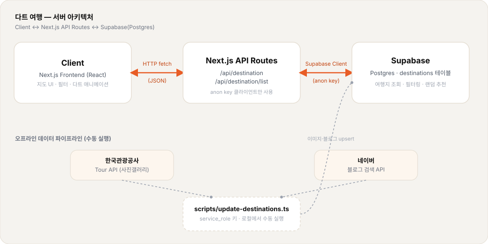

# 🎯 다트 여행

> 지도에 다트를 던져 랜덤 국내 여행지를 결정하세요

**[→ 서비스 바로가기](https://dart-travel.vercel.app)**

SNS에서 유행하는 "다트로 지도 찍어 여행지 정하기"에서 영감을 받아 만든 서비스입니다.

---

## ✨ 주요 기능

- **랜덤 여행지 추천** — 전국 여행지 중 랜덤 선택 (여행지는 지속적으로 업데이트)
- **다트 던지기 애니메이션** — D3.js 기반 정밀 한국 지도 + 베지어 곡선 다트 애니메이션
- **여행지 정보 제공** — 한국관광공사 공식 사진, 여행지 관련 네이버 블로그 리스트 제공
- **조건 필터링** — 계절 / 테마 / 당일치기 유무 등의 필터링 기능으로 사용자 니즈에 맞는 여행지 후보군 설정

---

## 🛠 기술 스택

| 분류       | 기술                                   |
| ---------- | -------------------------------------- |
| Framework  | Next.js 16 (App Router)                |
| Language   | TypeScript                             |
| Animation  | Framer Motion                          |
| Map        | D3.js + GeoJSON                        |
| Database   | Supabase (Postgres)                    |
| API        | 한국관광공사 Tour API, 네이버 검색 API |
| Deployment | Vercel                                 |

## 🏗 아키텍처

